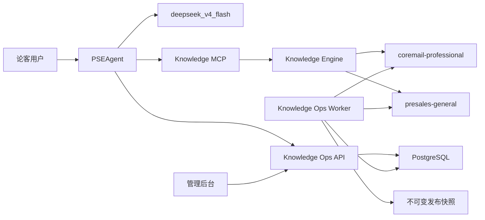

# PSEAgent 双知识库与知识运营后台上线手册

## 1. 上线目标与不可变约束

本手册覆盖两个 Obsidian Git 知识库、PSEAgent 问答服务、知识引擎、知识运营 API、可视化管理后台和异步发布 worker。

上线环境必须满足以下约束：

- 所有模型角色固定使用 `deepseek_v4_flash`。
- 每次发布同时锁定专业库 revision、通用库 revision、答案契约 revision 和答案卡目录 hash。
- 答案卡必须经过非作者评审；创建者不能自行批准。
- 发布前必须通过 4 组 × 5 类问题的 20 题门禁；任意一题、任意安全禁语或任意依赖可用性检查失败都禁止发布。
- 精确答案卡命中必须同时证明 `answerCardActivated=true`，不能只统计“匹配到”。
- 原始用户问题、回答和反馈正文只以 AES-256-GCM 密文保存；日志、健康检查和审计事件不得包含正文和密钥。

## 2. 生产拓扑



推荐将 API、后台静态资源、worker 和知识引擎部署在同一受控内网主机。外部访问通过 TLS 反向代理进入；服务本身默认只绑定 `127.0.0.1`。

## 3. 目录与权限

建议使用独立运行账户，并准备以下目录：

```text
C:/runtime/pseagent/
  platform/                  # pseagent-platform 只读发布包
  coremail-professional/     # 专业库 Git 工作副本
  presales-general/          # 通用库 Git 工作副本
  indexes/                   # 当前知识索引
  snapshots/                 # 发布目录与回滚快照
  worktrees/                 # worker 临时 Git worktree
  knowledge-ops-admin/       # 管理后台 dist
```

运行账户需要：

- 对两个知识库拥有受控 Git 读写权限；
- 对 `indexes`、`snapshots`、`worktrees` 拥有读写权限；
- 对平台发布包和后台静态文件只有读取权限；
- 不能使用个人管理员账户长期运行服务。

## 4. 构建与制品

要求 Node.js 24、Rust 工具链、Git 和 PostgreSQL 客户端。构建命令：

```powershell
npm.cmd ci
npm.cmd run typecheck
npm.cmd test
npm.cmd run build
```

正式制品至少包含：

- `apps/pseagent/dist/`
- `services/knowledge-mcp/dist/`
- `services/knowledge-ops/dist/` 及 `migrations/`
- `services/knowledge-ops-worker/dist/`
- `apps/knowledge-ops-admin/dist/`
- `target/release/knowledge-engine.exe`
- `config/knowledge-projects.local.json`
- `tests/regression/release-quality-suites.json`

禁止把 `.env.local`、模型密钥、Bearer token、数据库备份或明文反馈放进制品。

## 5. 密钥、令牌与角色

### 5.1 API Bearer token

为每个人或服务生成独立的至少 32 字节随机 token。明文只存入调用方的秘密管理系统；Knowledge Ops API 只配置其小写 SHA-256：

```json
[
  {
    "tokenHash": "<64位小写SHA-256>",
    "actor": { "actorId": "lunkr-feedback", "roles": ["service"] }
  },
  {
    "tokenHash": "<64位小写SHA-256>",
    "actor": { "actorId": "ops-operator", "roles": ["operator"] }
  },
  {
    "tokenHash": "<64位小写SHA-256>",
    "actor": { "actorId": "release-manager", "roles": ["release_manager"] }
  }
]
```

将压缩后的 JSON 放入 `KNOWLEDGE_OPS_TOKEN_HASHES_JSON`。生产环境保持：

```text
KNOWLEDGE_OPS_ALLOW_PLAINTEXT_TOKENS=false
```

编辑者与评审者必须使用不同 `actorId`。专业库和通用库分别分配 `professional_editor` / `professional_reviewer`、`general_editor` / `general_reviewer`。

### 5.2 反馈加密密钥环

每把密钥必须是 32 字节随机值的 Base64。配置示例：

```text
KNOWLEDGE_OPS_ENCRYPTION_KEYS_JSON={"1":"<base64-key-v1>"}
KNOWLEDGE_OPS_KEY_VERSION=1
KNOWLEDGE_OPS_ALLOW_SINGLE_ENCRYPTION_KEY=false
```

轮换时先加入新版本并把 `KNOWLEDGE_OPS_KEY_VERSION` 指向新版本：

```text
KNOWLEDGE_OPS_ENCRYPTION_KEYS_JSON={"1":"<old>","2":"<new>"}
KNOWLEDGE_OPS_KEY_VERSION=2
```

旧版本在历史反馈完成重加密或超过保留期之前不能移除。回滚应用版本时也必须保留它所需的全部历史密钥。

## 6. 核心环境变量

从 `.env.example` 复制配置模板，通过服务管理器注入真实值。重点配置：

```text
PSE_MODEL_NAME=deepseek_v4_flash
PSE_RESOLVER_MODEL_NAME=deepseek_v4_flash
PSE_PLANNER_MODEL_NAME=deepseek_v4_flash
PSE_SYNTHESIZER_MODEL_NAME=deepseek_v4_flash
PSE_VERIFIER_MODEL_NAME=deepseek_v4_flash

PSE_TASK_SPEC_SHADOW_ENABLED=true
PSE_TASK_SPEC_ACTIVE_ENABLED=true
PSE_MULTI_DOMAIN_ACTIVE_ENABLED=true
PSE_ANSWER_CARD_SHADOW_ENABLED=true
PSE_ANSWER_CARD_EXACT_ACTIVE_ENABLED=true
PSE_ANSWER_CARD_REQUIRED=true
PSE_ANSWER_CARD_FAMILY_ACTIVE_ENABLED=true
PSE_ANSWER_CARD_CATALOG_PATH=C:/runtime/pseagent/answer-card-catalog.json

PSE_ANSWER_REVIEW_MODEL_NAME=deepseek_v4_flash
PSE_ANSWER_REVIEW_TIMEOUT_MS=60000
PSE_ANSWER_REVIEW_MAX_TOKENS=4096

KNOWLEDGE_OPS_HOST=127.0.0.1
KNOWLEDGE_OPS_PORT=19830
KNOWLEDGE_OPS_ALLOW_REMOTE=false
```

如果必须绑定非回环地址，需显式设置 `KNOWLEDGE_OPS_ALLOW_REMOTE=true`，并在服务前强制 TLS、来源限制和企业身份网关。

## 7. 启动顺序

1. 启动 PostgreSQL，确认备份策略和磁盘水位。
2. 启动 Knowledge Ops API。API 启动时自动执行幂等迁移。
3. 启动 Knowledge Ops worker。
4. 使用已批准的两个 Git revision 启动 Knowledge Engine。
5. 编译并发布与这两个 revision 对齐的答案卡目录。
6. 启动 PSEAgent / 论客直连进程。生产环境启用 `PSE_ANSWER_CARD_REQUIRED=true` 后，答案卡未启用、目录不可读、结构无效或不存在已批准卡片时会拒绝启动，不能静默降级为无卡回答。
7. 通过反向代理开放管理后台。

常用命令：

```powershell
npm.cmd --workspace @pseagent/knowledge-ops run start
npm.cmd --workspace @pseagent/knowledge-ops-worker run start
npm.cmd --workspace @pseagent/app run start
```

所有长期进程应交给 Windows 服务管理器或等价的进程监督器，配置异常退出重启、标准输出轮转和受控关闭。不要用交互式终端承担生产守护。

## 8. 健康与就绪检查

Knowledge Ops：

```powershell
Invoke-RestMethod http://127.0.0.1:19830/healthz
Invoke-RestMethod http://127.0.0.1:19830/readyz
```

- `/healthz` 只表示进程存活，不访问数据库。
- `/readyz` 必须完成 PostgreSQL `SELECT 1`；失败时返回 HTTP 503，且不暴露连接串或异常正文。

Knowledge Engine：

```powershell
Invoke-RestMethod http://127.0.0.1:19829/health
```

必须同时验证两个项目的 `lexicalStatus=ready`、`graphStatus=ready`，并逐字比对目标 Git revision。只要一个 revision 不一致，就不能把实例加入服务。

## 9. 知识运营工作流

### 9.1 从用户反馈到答案卡

1. 论客用户对回答选择“错误 / 不完整 / 过时 / 有风险 / 其他”。
2. 反馈以 request ID 幂等写入，正文加密，列表页默认只显示元数据。
3. 运营人员在后台完成分诊，判断属于检索缺口、知识缺口、逻辑缺口、路由缺口还是表达缺口。
4. 对可复用问题创建或修订答案卡：标准问题、别名、适用/排除条件、必答义务、禁答声明、优先证据路径、答案模板。
5. 独立评审者批准；作者不能自审。
6. 将真实问题加入回归集。相同问题以后走精确答案卡，不再依赖模型临时分类。

### 9.2 发布

发布顺序固定为：

```text
反馈分诊 → 答案卡修订 → 双人评审 → 20题真实门禁 → 创建发布 → worker 编译目录 → 快照发布
```

任何阶段失败均保持当前 active release 不变。worker 使用隔离 Git worktree 写回，不能直接覆盖知识库工作区。

## 10. 4×5 发布质量门禁

门禁覆盖四组并发会话，每组依次包含：标准问法、别名问法、错别字问法、上下文追问、负向/越界问题。

运行前必须锁定：

- `COREMAIL_PROFESSIONAL_REVISION`
- `PRESALES_GENERAL_REVISION`
- `PSE_ANSWER_CARD_CATALOG_PATH`
- `KNOWLEDGE_ENGINE_URL` 与只读 token

执行：

```powershell
npm.cmd run probe:release-quality
```

放行条件：

- 20/20 用例全部完成并通过；
- 固定模型检查全部通过；
- scope、状态、引用数、必答概念、禁答声明全部通过；
- 要求答案卡的用例必须匹配且激活；
- 安全失败为 0，可用性失败为 0；
- 每题不超过用例配置的最大延迟。

验收基线：20/20、平均分 1.0、P95 38.957 秒、0 安全失败、0 可用性失败。

## 11. 备份、恢复与回滚

### 11.1 必备备份

- PostgreSQL：每日全量 + WAL/增量，至少保留 30 天；备份文件必须加密。
- 两个知识库：推送到受保护 Git 远端，禁止只依赖本机工作副本。
- 发布快照：保留当前 active、前一稳定版本和最近审计周期内的 manifests/catalogs。
- 秘密：由企业秘密管理系统版本化保存，不进入数据库备份或 Git。

### 11.2 回滚

在后台选择目标稳定 release 执行 rollback。worker 必须完成：

1. 校验目标 manifest 和 catalog hash；
2. 原子切换快照指针；
3. 把数据库 release 状态更新为 active；
4. 记录操作者、目标 release 和时间；
5. 重启或滚动刷新 Knowledge Engine；
6. 重新验证两个 revision 和最小烟雾用例。

回滚不应修改或删除用户反馈、评审记录和审计事件。

### 11.3 恢复演练

至少每季度在隔离环境完成一次 PostgreSQL 恢复、Git checkout、快照恢复、密钥环解密和 20 题门禁。未演练的备份不视为可恢复备份。

## 12. 监控与告警

至少监控：

- API `/readyz`、Knowledge Engine `/health`；
- P50/P95/P99 回答延迟、temporarily_unavailable 比例；
- 模型 429/5xx 重试次数和模型并发队列等待时间；
- 知识 MCP 重连次数；
- 答案卡精确匹配率、激活率、激活失败原因；
- 各义务覆盖率、无引用回答比例、安全禁语命中数；
- feedback 新增/积压、worker queued/running/failed 数、最老任务等待时间；
- 知识库 revision 漂移、发布快照 hash 不一致；
- PostgreSQL 连接、容量、备份新鲜度和恢复演练日期。

建议告警：可用性失败或安全禁语命中立即 P1；revision/hash 漂移、发布任务失败、readyz 连续失败为 P1；反馈积压和 P95 恶化为 P2。

## 13. 故障处置

| 现象 | 优先检查 | 处置 |
|---|---|---|
| 多个窗口出现毫秒级连续失败 | 模型 429、知识 MCP 重连 | 检查模型并发闸门和知识工具串行队列，禁止盲目扩大并发 |
| 答案卡已匹配但回答仍偏题 | `answerCardActivated`、义务映射 | 阻止发布；检查卡契约、customer_input 域和优先证据路径 |
| 有引用但结论错误 | 卡的必答/禁答义务、证据版本 | 下线相关卡或回滚 release，创建真实反馈回归用例 |
| `/readyz` 为 503 | PostgreSQL 连通性与迁移 | 保持实例摘流，恢复数据库后再加入服务 |
| revision 不一致 | Git HEAD、catalog domains、engine health | 禁止热修补；重新编译目录并按发布流程切换 |
| 旧反馈轮换后无法解密 | 密钥环历史版本 | 恢复对应历史密钥；不得伪造或丢弃反馈 |

## 14. 上线签字清单

- [ ] 全仓 typecheck、test、build 通过。
- [ ] 两个知识库工作区干净，目标 revision 已推送受保护远端。
- [ ] 答案卡目录与两个 revision 完全一致。
- [ ] 20/20 真实门禁通过，报告已导入后台并关联 release。
- [ ] 作者与评审者职责分离。
- [ ] API 令牌只以 hash 配置；调用方明文在秘密管理系统。
- [ ] AES 密钥环包含当前和必要历史版本。
- [ ] `/healthz`、`/readyz`、Knowledge Engine `/health` 正常。
- [ ] PostgreSQL、Git 和快照备份已完成且可恢复。
- [ ] 回滚目标和当班负责人明确。
- [ ] 管理后台经 TLS、身份网关和最小权限访问。
