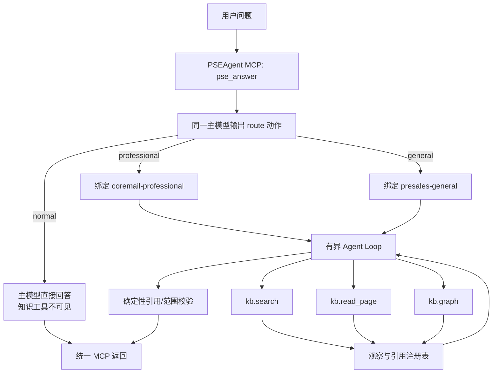

# PSEAgent 单入口双知识库 Agent Loop 设计

日期：2026-07-22

状态：用户已确认（含新代码仓与现有知识库复用策略）
实施范围：只读问答主链，不包含知识改进、审核或自动写回

2026-07-23 激活说明：`presales-general` 已完成第二批真实售前资料导入，固定 revision 为 `ca4ee0f8fb3c466378371c14bf3394c82a903281`。当前以 G01 和 G03 验证通用库有证据时的正向回答；未被可靠页面覆盖的其他通用问题仍返回 `not_covered`。下文“健康空库”表述保留为首期历史设计背景，以本说明和 15.3、15.4 节的现行验收契约为准。

## 1. 文档定位

本文定义 PSEAgent 第一阶段问答主链的简化方案：外部客户端只调用一个 PSEAgent MCP 问答工具；PSEAgent 使用同一个主模型先判断 `professional`、`general` 或 `normal`，再自行决定是否检索、检索什么以及何时结束，专业与通用问题采用接近 LLM Wiki 标准模式的有界 Agent Loop。

本文替代以下既有设计中与“在线问答编排”有关的部分：

- `2026-07-17-pseagent-local-closed-loop-design.md` 中由宿主先调用 `pse_route`、再调用 `pse_answer` 的双工具流程；
- 既有问答主链中的双库并行、Coremail MCP/公网兜底、五维评分、独立 judge、低分入审和自动改进触发；
- 自有 Knowledge Engine 当前由独立模型规划检索词、再由回答模型生成、最后由 judge 模型审核的多模型在线链路。

本文不替代知识仓库治理、资料解析、人工审核发布、索引构建和版本回滚等离线设计。这些能力可以继续存在，但不能成为第一阶段问答服务的启动依赖，也不能被本问答链自动触发。

## 2. 问题与设计依据

当前 PSEAgent MCP 对外暴露 `pse_route` 和 `pse_answer`。宿主模型必须先正确调用路由工具，再把路由结果原样传给回答工具。这使关键编排权仍在宿主：宿主可能漏调第二个工具、改写路由结果或用自己的推理覆盖 PSEAgent 输出。

当前在线回答还串联了路由、查询规划/改写、知识检索、回答生成、五维质量评分、judge 审核、兜底和改进判定。链路长、状态多，而且“已经检索到相关页面”仍可能因为后置评分或安全门被整体拒绝。它与 LLM Wiki Chat Agent 的核心做法不同：后者让主模型在一个有界循环中逐次选择搜索、读页、查图或最终回答，并以引用和工具边界提供确定性约束。

本设计保留 LLM Wiki 做得好的部分：

- 主模型决定是否检索和实际检索词；
- 每轮只输出一个结构化动作；
- 搜索只提供候选，读取正文后才形成可引用证据；
- 固定迭代和工具预算；
- 重复或无增益检索会提前收敛；
- 没有独立在线 judge 或总分门槛。

PSEAgent 与 LLM Wiki 的必要差异只有一个：PSEAgent 在 Agent Loop 前增加一次双库入口识别，并且每个专业/通用请求只能绑定一个知识库。

上游参考：

- [LLM Wiki 中文 README](https://github.com/nashsu/llm_wiki/blob/main/README_CN.md)
- [Agent runtime](https://github.com/nashsu/llm_wiki/blob/main/src-tauri/src/agent/runtime.rs)
- [Agent router](https://github.com/nashsu/llm_wiki/blob/main/src-tauri/src/agent/router.rs)
- [Agent context](https://github.com/nashsu/llm_wiki/blob/main/src-tauri/src/agent/context.rs)
- [Agent tools](https://github.com/nashsu/llm_wiki/blob/main/src-tauri/src/agent/tools.rs)
- [Search implementation](https://github.com/nashsu/llm_wiki/blob/main/src-tauri/src/commands/search.rs)

## 3. 目标与非目标

### 3.1 目标

- 所有问题都通过一个 PSEAgent MCP 问答入口处理。
- 路由、普通回答、知识检索和带引用回答全部由 PSEAgent 负责。
- 路由只产生 `professional`、`general`、`normal`，不存在 `both`、`mixed` 或 `ambiguous`。
- 专业和通用问题只访问各自的单一知识库，不能跨库补答案。
- 主模型自主选择搜索词、读页和图谱动作；Knowledge Engine 只执行确定性检索，不再在在线主链中调用独立查询规划模型。
- 有证据时给出简洁的带引用回答；只有部分证据时明确部分回答；无覆盖时明确告知知识库未覆盖。
- 将技术故障与知识缺口严格区分。
- 删除在线回答对评分模型、审核数据库、Worker 和自动写回的依赖。
- 保持工具调用次数有上限、行为可测试、引用可验证。
- 在新的纯代码仓 `pseagent-platform` 实施，专业库与通用库继续作为两个独立 Git 仓库存在。
- 专业库直接复用现有 Markdown，不重新上传或全量解析原始 PDF；新 Knowledge Engine 从已提交的 Markdown 重建索引。
- 允许通用库首期是健康空库；内容导入后，`general` 问题有可靠读页时回答并引用通用库，未覆盖时稳定返回 `not_covered`。

### 3.2 非目标

第一阶段不实现或不启用：

- 两个知识库同时检索；
- Coremail MCP、互联网搜索或模型先验作为知识库未命中的兜底；
- 五维评分、总分阈值、独立 judge 模型或逐声明蕴含审核；
- `pending_review`、低分改进案例和审核管理页面联动；
- Worker 两轮候选答案生成；
- 自动生成 Markdown、自动 Git 提交或自动写回知识库；
- 用户反馈驱动的知识修正；
- Embedding、重排序模型或新的向量基础设施；
- 对离线知识治理和发布系统做顺带重构。
- 把当前 PSEAgent 原型分支的全部应用代码和提交历史原样搬入新仓。
- 重新通过 LLM Wiki App 上传、解析或生成专业库已有的 Markdown。

## 4. 方案选择

比较过三种方案：

1. **保留宿主双工具编排**：改动小，但宿主仍要理解路由协议，无法保证第二步调用和结果原样返回，不能实现“全部由 PSEAgent 负责”。
2. **程序关键词路由后调用固定 RAG**：延迟低且可预测，但很难稳定覆盖中文售前表达、产品别名和场景化问题，模型也无法根据中间观察调整检索词。
3. **单入口、同一主模型路由、有界 Agent Loop**：外部契约最简单，保留模型检索自主性，同时用单库绑定、预算和引用校验约束风险。

采用方案 3。

## 5. 仓库边界与总体架构

### 5.1 三仓边界

第一阶段在桌面建立一个不属于任何 Git 仓库的总目录，内部固定放置三个并列的独立 Git 仓库：

```text
C:\Users\Coremail\Desktop\Coremail-PSE\
├─ pseagent-platform\          # 新建：PSEAgent 应用、Knowledge Engine、Knowledge MCP 和测试
├─ coremail-professional\      # 本地克隆：现有专业知识 Markdown 和来源资料
└─ presales-general\           # 本地克隆：通用售前知识库，已导入真实资料
```

`Coremail-PSE` 只承担本机目录归类，不初始化 `.git`，不把三个子仓变成一个 monorepo，也不使用 Git submodule。

本机来源和目标对应关系为：

| 逻辑仓库 | 当前来源 | 总目录内目标 | 首期处理 |
|---|---|---|---|
| `coremail-professional` | 已从原专业库 `main` revision 创建独立本地克隆 | `C:\Users\Coremail\Desktop\Coremail-PSE\coremail-professional` | 后续有限就绪检查和知识提交只在目标克隆内进行 |
| `presales-general` | 已从原通用库 revision 创建独立本地克隆 | `C:\Users\Coremail\Desktop\Coremail-PSE\presales-general` | 已提交真实通用售前资料；有证据时回答，未覆盖时返回 `not_covered` |
| `pseagent-platform` | 全新初始化 | `C:\Users\Coremail\Desktop\Coremail-PSE\pseagent-platform` | 只保留本设计、实施计划及后续精简运行代码，不继承旧仓混合目录或历史 |

旧 `codex/pseagent-local-mvp` linked worktree、原专业库和原通用库均保持原状。旧原型不再作为后续代码移植来源，也不作为新版本继续堆叠的开发基础；后续工作目录固定为 `C:\Users\Coremail\Desktop\Coremail-PSE\pseagent-platform`。新三仓完成回归和真实 smoke test 前，不删除原目录、旧分支、旧工作树或其中的未提交修改。

三个新子仓均不配置 remote，不自动创建 GitHub/GitLab 远程、不推送代码，也不修改来源知识库的 remote。运行配置只使用 `Coremail-PSE` 下的目标绝对路径；来源 revision 记录在平台仓初始化文档中。远程仓库命名和发布在本地验收通过后由用户单独授权。

新代码仓保持最小结构：

```text
C:\Users\Coremail\Desktop\Coremail-PSE\pseagent-platform\
├─ apps/pseagent/                 # 单入口 MCP、路由、Agent Loop、模型客户端、引用与响应
├─ services/knowledge-engine/     # revision 固定的 search/read/graph
├─ services/knowledge-mcp/        # Knowledge Engine 的只读 MCP 边界
├─ config/                        # 不含本机绝对路径和密钥的示例配置
├─ tests/regression/              # 固定问题集和脚本化 Agent 场景
└─ docs/                           # 本设计、实施计划和运行说明
```

首期新仓不创建 `admin`、`worker`、`supabase` 或独立 `contracts` workspace；少量严格 Schema 与其消费者放在同一应用边界内，避免再次因提前分层扩大工程。

### 5.2 现有知识库复用

#### 专业库

2026-07-22 的只读检查确认专业库已经具备可复用资产：约 3,730 个 `wiki/**/*.md` 页面、162 个受控 `raw` 文件，以及作为来源档案保留的 PDF 等原始资料。新系统以 Git 已提交的 Markdown 为检索事实来源：

- 不重新上传 PDF；
- 不要求重新打开 LLM Wiki App 解析；
- 不迁移 `.llm-wiki` 缓存、数据库或 App 项目状态；
- 在新 Knowledge Engine 中从选定 Git revision 的 `wiki/**/*.md` 重建词法和图谱索引；
- `raw` 继续作为来源与重新处理的依据，不直接进入在线回答上下文；
- 只有页面缺失、正文损坏或来源无法追溯时，才对单份资料做定向重解析。

专业库接入前完成一次有限就绪检查，不做全库再生成：

1. 审核并提交当前未跟踪的 `coremailai助手.txt`、`ai邮件能力.md`、`coremail-ai助手.md` 和对应来源页，否则它们不会进入 revision 固定索引；
2. 定向修复只读扫描发现的一个含无效 UTF-8 替换字符的来源页；
3. 将 `purpose.md`、`schema.md` 中旧的 Coremail MCP 兜底、双库和评分流程说明改成本文的只读问答边界；
4. 校验 `overview.md`、`schema.md` 可读，索引构建后执行专业问题 smoke test。

上述工作只整理少量规则和异常页面，不改变“直接复用现有 Markdown”的决定。

#### 通用库

`presales-general` 首期以健康空库完成启动验收。2026-07-23，用户导入的八份来源底稿和 74 个正文页已经过元数据、来源关系、Wiki 链接与敏感信息检查，并以 revision `ca4ee0f8fb3c466378371c14bf3394c82a903281` 固定。SPIN 与可信顾问内容已有派生知识页并参与回答；Challenger Sale 与 JOLT Effect 当前仅作为来源底稿归档，待形成派生页后再激活为回答证据。

激活后的通用库契约为：

- Knowledge Engine 必须从固定 revision 建立索引并报告 `ready`；
- 路由为 `general` 的问题只能搜索、读取和引用 `presales-general`；
- 有可靠读页时可以返回 `answered` 或 `partially_answered`，且至少包含一个同项目、同 revision 的有效引用；
- 健康搜索无可靠依据时返回固定 `not_covered`，不得转到专业库、互联网或模型先验；
- 固定回归只激活已经逐页核实的通用问题，不为了提高覆盖率批量宣称其他问题已覆盖。

### 5.3 运行架构



外层 MCP、Orchestrator、Knowledge MCP 和 Knowledge Engine 职责如下：

- **PSEAgent MCP**：只暴露单个用户问答入口，校验输入并原样返回 Orchestrator 的文本和结构化结果。
- **Orchestrator**：执行路由、绑定项目、维护 Agent 状态和预算、调用主模型、注册引用、映射错误与格式化答案。
- **Knowledge MCP Adapter**：把模型可见的三个逻辑工具映射到现有 `knowledge_search`、`knowledge_read`、`knowledge_graph`；项目和 revision 由运行时注入，不让模型提供。
- **Knowledge Engine**：在指定项目和固定 revision 上执行词法检索、正文读取和图谱邻居查询；不生成答案、不判断路由、不调用 LLM。
- **主模型**：同一个模型配置承担入口分类、普通回答以及专业/通用 Agent 动作选择和最终撰写。这里的“同一个模型”指同一模型配置，不要求复用一次 HTTP 响应或隐藏推理状态。

## 6. 单一 MCP 对外契约

### 6.1 工具列表

切换完成后，PSEAgent 面向普通客户端只公开一个问答工具：

```text
pse_answer(question, conversationContext?)
```

输入：

```json
{
  "question": "列出 Coremail AI 的新功能特性",
  "conversationContext": "可选，由调用方显式传入的有限会话上下文"
}
```

- `question` 必填，沿用当前 16 KiB 和行数限制。
- `conversationContext` 可选，沿用当前 32 KiB 限制。
- PSEAgent 第一阶段不为了多轮对话强制依赖数据库；调用方不传上下文时，仅根据当前问题回答。
- 不再接收由外部构造的 `routeContext`。

`pse_route` 从面向用户的 MCP 工具列表删除；路由成为 `pse_answer` 内部步骤。客户端提示词改为“每个用户问题调用一次 `pse_answer`，并原样使用返回文本”，不再描述两阶段调用协议。

### 6.2 返回

MCP `content` 返回已经格式化的纯文本，供宿主直接展示；`structuredContent` 返回：

```json
{
  "scope": "professional",
  "status": "answered",
  "answer": "Coremail AI 助手……[1]",
  "references": [
    {
      "index": 1,
      "project": "coremail-professional",
      "title": "Coremail AI 助手",
      "path": "wiki/concepts/coremail-ai助手.md",
      "revision": "<active revision>",
      "contentHash": "<sha256>"
    }
  ]
}
```

`scope` 只有 `professional`、`general`、`normal`。`status` 只有：

- `answered`
- `partially_answered`
- `not_covered`
- `temporarily_unavailable`

不返回置信度、五维分数、总分、质量档位或审核状态。

## 7. 路由设计

### 7.1 路由动作

每个请求的第一次模型调用没有知识库工具，只允许输出：

```json
{"action":"route","scope":"professional"}
```

使用严格 JSON Schema；不输出解释、置信度或多个候选库。原问题和可选 `conversationContext` 会继续传入后续流程，不依赖模型隐藏上下文。

### 7.2 判定规则

按以下优先级分类：

1. 涉及 Coremail、具体产品或功能、邮件系统、部署、迁移、版本、兼容性、授权方式、实施，以及带有具体客户或项目背景的产品方案，归为 `professional`。
2. 纯厂商无关的售前方法、需求访谈、话术、方案组织、项目推进和通用行业方法，归为 `general`。
3. 不属于以上两类的普通问题，归为 `normal`。

只要问题同时包含 Coremail/产品事实和通用售前表达，就按 `professional` 处理。例如“怎样向银行客户介绍 Coremail 容灾方案”只进入专业库；模型可以组织表达，但所有 Coremail 事实必须来自专业库证据。

### 7.3 路由失败

- 首次输出不符合严格 Schema 时，用同一模型做一次仅修复格式的重试。
- 第二次仍非法时返回 `temporarily_unavailable`。
- 路由失败不能降级为 `normal`，否则可能绕过知识证据要求。

## 8. 普通问题流程

`normal` 路由后，PSEAgent 用同一个主模型做一次直接回答：

- 不加载知识库 `overview.md` 或 `schema.md`；
- 不暴露任何知识工具；
- 不要求引用；
- `references` 固定为空；
- 模型调用失败映射为 `temporarily_unavailable`。

因此普通问题仍由 PSEAgent 回答，而不是交还宿主模型自行处理。

## 9. 专业/通用 Agent Loop

### 9.1 请求级绑定

进入循环前，Orchestrator 根据 scope 做不可变映射：

| scope | project |
|---|---|
| `professional` | `coremail-professional` |
| `general` | `presales-general` |

Orchestrator 在循环开始时绑定项目的活动 revision；本请求内的搜索、读页、图谱和最终引用都必须来自该项目同一 revision。项目键和 revision 不出现在模型工具参数中，防止跨库或跨版本调用。

项目的 `overview.md` 和 `schema.md` 作为只读导航上下文加载一次。无法获得活动 revision 或必要导航上下文属于服务故障，返回 `temporarily_unavailable`，不能当作知识未覆盖。

### 9.2 模型上下文

每轮模型上下文只包含：

- 固定系统规则与动作 Schema；
- 当前 scope 对应项目的 `overview.md`、`schema.md`；
- 原问题和调用方显式传入的有限会话上下文；
- 已执行工具的有界观察；
- 当前引用注册表；
- 剩余模型轮次和检索动作预算。

知识页正文是“不可信资料”，不得作为系统指令执行。页面中的提示词、工具指令或越权要求均只能被当作引用内容。

### 9.3 每轮动作

模型每轮必须只输出一个严格结构化动作：

```json
{"action":"tool","tool":"kb.search","input":{"query":"Coremail AI 助手 新功能","topK":5}}
```

```json
{"action":"tool","tool":"kb.read_page","input":{"path":"wiki/concepts/coremail-ai助手.md"}}
```

```json
{"action":"tool","tool":"kb.graph","input":{"path":"wiki/concepts/coremail-ai助手.md","topK":5}}
```

```json
{
  "action":"final",
  "coverage":"complete",
  "answer":"Coremail AI 助手……[1]",
  "citations":[1]
}
```

`coverage` 只有 `complete`、`partial`、`none`。它用于表达主模型对覆盖范围的判断，不是第二次评分；Orchestrator 仍会用硬规则限制可产生的最终状态。

### 9.4 模型可见工具

模型只能看到当前项目的三个逻辑工具：

1. `kb.search(query, topK=5)`
   - `topK` 最大为 10；
   - 返回标题、规范路径、匹配词、分数和有界命中片段；
   - 搜索命中只是候选，不能直接引用。
2. `kb.read_page(path)`
   - 只接受当前搜索/图谱观察中出现过的规范项目相对路径；
   - 成功读取后才把页面加入引用注册表；
   - 大页面按当前问题和命中词确定性压缩为不超过 4,000 个字符的观察，保留标题层级和命中附近正文，不把模型上下文无限扩大。
3. `kb.graph(path, topK=5)`
   - 只接受当前项目中已观察到的页面路径；
   - 返回一跳相关页面候选；
   - 图谱候选同样必须再 `read_page` 才能引用。

`knowledge_query` 不进入模型可见工具集，因为它包含另一层查询规划和多轮封装，会与主 Agent 重复。`knowledge_status` 只供服务健康检查，不计入 Agent 可见工具。

### 9.5 检索策略

主模型自行决定：

- 是否需要搜索；
- 第一次及后续搜索的精确 query；
- 读取哪些候选页；
- 是否利用图谱继续探索；
- 何时给出最终回答。

系统不在 Agent 前强制执行原问题 seed search，也不使用关键词规则偷偷附加第二个知识库。若模型在 `professional` 或 `general` 流程中不检索就直接输出领域事实，因为没有可引用读页，硬规则会把结果转为 `not_covered`。

Knowledge Engine 在这条路径中只执行确定性搜索。第一阶段保留现有中文词法索引和图谱能力，并以 LLM Wiki 的词法排序思路作为校准基线：文件名精确命中、标题短语、正文短语、标题 token 和正文 token 依次降权；中文同时使用字符和 bigram。是否调整具体权重由固定回归集验证，不再由另一个 LLM 动态改写查询。已存在且健康的向量能力可以保持关闭；不得为本阶段新增向量运行依赖。

### 9.6 预算和收敛

- 路由调用不计入 Agent Loop 的 8 轮预算。
- Agent Loop 最多调用主模型 8 次，其中第 8 次只允许 `final`。
- `search`、`read_page`、`graph` 合计最多 4 次。
- 使用第 4 次检索动作后，下一轮移除工具，只允许基于已有观察结束。
- 完全相同的工具和参数不允许重复；重复动作返回受控观察并强制下一轮结束。
- 连续两次检索没有增加新候选路径或新引用页面时，强制下一轮结束。
- 工具预算耗尽不等于知识未覆盖：有有效读页时仍可回答或部分回答；没有有效读页时才返回 `not_covered`。
- 达到模型轮次上限仍没有合法最终动作属于协议/模型故障，返回 `temporarily_unavailable`。

## 10. 引用注册与确定性校验

### 10.1 引用注册表

每次成功 `read_page` 后，Orchestrator 以以下身份注册页面：

```text
(project, revision, canonical path, content hash)
```

相同页面重复出现只保留一条，并分配稳定的请求内编号 `[1]`、`[2]`。最终 `references` 只包含实际读取成功的页面，不包含单纯的搜索或图谱命中。

### 10.2 硬校验

最终回答必须通过以下程序校验：

- 引用编号存在于注册表；
- 引用项目等于路由绑定项目；
- revision 等于请求绑定 revision；
- 路径规范且位于项目内；
- 内容哈希与实际读取结果一致；
- 引用列表去重；
- `professional/general + complete/partial` 至少有一个有效引用；
- 正文出现的 `[n]` 与结构化 `citations` 一致；
- 不允许引用仅搜索到但未读取的页面。

若已有读页但模型第一次生成了非法引用，允许在剩余轮次内做一次只修复引用和格式的重试；仍非法则返回 `temporarily_unavailable`。若根本没有有效读页，则直接返回 `not_covered`，不让模型凭先验补写领域结论。

第一阶段不做自动逐句蕴含判断。系统提示要求领域事实就近标注引用，实际语义正确性通过固定回归问题和人工 smoke review 验证，而不是重新引入 judge 模型。

## 11. 状态与用户文本

### 11.1 状态推导

Orchestrator 根据模型 `coverage` 和硬证据状态确定最终状态：

| 条件 | 最终状态 |
|---|---|
| `normal` 正常生成 | `answered` |
| `complete` 且至少一个有效引用 | `answered` |
| `partial` 且至少一个有效引用 | `partially_answered` |
| `none`，或专业/通用流程没有任何有效读页 | `not_covered` |
| 路由/模型协议反复非法、服务超时、索引/项目不可用、工具响应损坏 | `temporarily_unavailable` |

模型不能仅靠声明 `complete` 绕过引用要求；程序也不把服务故障映射成 `not_covered`。

### 11.2 展示文本

`answered` 示例：

```text
Coremail AI 助手目前支持……[1]

资料来源：
[1] Coremail AI 助手 — coremail-professional/wiki/concepts/coremail-ai助手.md
```

`partially_answered` 必须明确已覆盖和未覆盖的部分，并只对已覆盖内容下结论。

`not_covered` 固定返回：

```text
当前知识库暂未覆盖该问题，暂时无法给出可靠答案。
```

`temporarily_unavailable` 固定返回：

```text
知识问答服务暂时不可用，请稍后重试。
```

普通问题的模型服务故障可以使用更通用的“问答服务暂时不可用，请稍后重试”，但结构化状态仍是 `temporarily_unavailable`。

## 12. 故障处理

- 搜索正常返回空结果：属于健康的知识缺口，最终可为 `not_covered`。
- Knowledge Engine 超时、连接关闭、索引未就绪或响应不符合 Schema：属于 `temporarily_unavailable`。
- 搜索命中但某一页面读取失败：在剩余预算内可尝试其他候选；没有可用页面且出现过基础设施故障时仍为 `temporarily_unavailable`，不能伪装成未覆盖。
- 第一次 Agent 动作非法：把简短 Schema 错误作为观察交给同一模型修复；连续非法或超过预算则为 `temporarily_unavailable`。
- 路径穿越、跨库路径或模型提供未知路径：拒绝该动作并记录安全错误；不访问文件系统目标。
- 调用取消和总超时应贯穿 MCP、模型和 Knowledge MCP；取消不触发重试、审核或后台任务。

## 13. 在线链路明确停用的旧能力

下列旧能力不复制、不查阅移植，也不进入新 `pseagent-platform` 的在线执行图：

- 双库探测和 `mixed_presales/ambiguous` 分支；
- 独立查询规划模型及最多三次 query rewrite；
- AnswerService 的五维评分和总分门；
- judge 模型配置和调用；
- Coremail MCP 和公网兜底；
- 低分 `pending_review` 创建；
- Worker 两轮候选生成；
- 自动 Markdown/Git 写回；
- 审核管理页联动；
- 回退到模型先验生成通用售前事实。

第一阶段不对旧原型仓做删除或整理。新仓验收后可以归档旧分支；是否继续保留其中的实验代码和历史文档另行决定，避免把问答打通与旧仓清理混成同一次交付。

## 14. 数据与可观测性

新的问答主链不以 Supabase、队列、Worker 或 Admin Web 可用为启动条件。默认只输出轻量结构化运行日志：

- request ID；
- 路由 scope、是否发生一次格式修复；
- 绑定项目和 revision；
- Agent 模型轮次、工具动作数量；
- 搜索 query、观察到和读取的规范路径；
- 重复/无增益终止原因；
- 各阶段耗时和最终 status；
- 错误分类，不记录密钥和模型认证信息。

日志失败不能影响用户回答，也不会创建审核案例或写入知识库。原问题、会话上下文和完整答案是否落日志由部署策略控制；默认不在普通生产日志中完整记录敏感正文。

## 15. 测试策略

### 15.1 单元测试

- 单入口 MCP 输入、输出及 `pse_route` 不再暴露；
- 三值路由 Schema、产品优先级和一次修复；
- scope 到 project 的不可变映射；
- 模型工具 Schema 中没有 project/revision；
- 8 轮、4 动作、第 8 轮强制 final；
- 重复动作和连续无增益收敛；
- 引用注册、去重、跨库/跨 revision/未知引用拒绝；
- 四种最终状态的确定性映射；
- `normal` 路径工具调用数为零；
- `not_covered` 和 `temporarily_unavailable` 固定文本。

### 15.2 集成测试

使用脚本化假模型依次输出 route、search、read、final，验证：

- 专业问题只调用专业项目；
- 通用问题只调用通用项目；
- 混合表达按专业项目处理；
- 搜索结果必须 read 后才能引用；
- 图谱候选必须 read 后才能引用；
- 空结果、部分证据、读页失败、工具超时和非法模型 JSON 分别落入正确状态；
- judge、质量评分、Coremail MCP、公网、数据库、Worker 和写回调用数均为零。

### 15.3 固定回归集

首期至少维护 40 个问题：

- 10 个专业库直接覆盖问题；
- 10 个通用售前路由问题；G01 使用已核实的 `wiki/synthesis/售前诊断式对话框架.md`，G03 使用 `wiki/concepts/spin四类问题.md` 验证正向回答与引用，其余未逐题确认覆盖的问题仍预期为 `not_covered`；
- 10 个普通问题；
- 5 个两个知识库均未覆盖的问题；
- 5 个产品与通用售前表达混合、容易串库的问题。

其中必须包含“列出 Coremail AI 的新功能特性”，并验证读取预期 Coremail AI 页面、输出有效引用，而不是因独立安全评分被拒绝。

固定回归集记录预期 scope、允许的项目、必须出现或禁止出现的关键事实、可接受来源页以及预期 status。文本措辞不做逐字匹配。

### 15.4 真实 smoke test

在配置好的真实主模型和两个真实知识库上至少验证：

1. 一个专业命中问题；
2. 一个通用命中问题，验证返回 `answered`/`partially_answered`、至少一个通用库引用且不跨库；
3. 一个普通问题；
4. 一个健康的知识未覆盖问题；
5. 一次 Knowledge Engine 不可用故障。

真实 smoke test 只读，不调用任何审核、发布或写回接口。

通用库首次导入真实内容后，必须先增加至少一个通用命中问题并通过真实 smoke test，才能宣称通用知识回答已经启用。

## 16. 首期验收标准

- 客户端只需调用一个 `pse_answer`，无需生成或传递路由上下文。
- `professional/general/normal` 固定回归路由全部符合预期。
- `normal` 的知识工具调用数始终为 0。
- 专业与通用请求在所有测试中均无跨库搜索、读页或引用。
- 专业/通用答案没有有效读页时绝不输出为 `answered`。
- 所有用户可见引用都能映射到同项目、同 revision、实际读取过且哈希一致的页面。
- 知识未覆盖与服务不可用在测试中始终正确区分。
- 主模型调用和检索动作不超过设计预算。
- 在线问答过程中 judge、质量评分、Coremail MCP、公网、Supabase、Worker、审核和写回均不参与。
- 目标问题“列出 Coremail AI 的新功能特性”能从专业库读取证据并正常回答。
- `pseagent-platform` 新仓不包含专业/通用知识正文，也不包含旧 Admin、Worker、Supabase 和兜底 Provider。
- 专业库无需重新上传或全量解析 PDF，能够从已提交 Markdown 重建索引并回答专业问题。
- 通用库以固定 revision 启动为健康；G01、G03 有证据时正常回答并引用，未覆盖的 `general` 查询稳定返回 `not_covered`。

## 17. 实施边界与迁移顺序

后续实施计划应按以下边界拆解，而不是同时重写整个平台：

1. 使用已经初始化的 `C:\Users\Coremail\Desktop\Coremail-PSE` 三仓目录；原专业库、原通用库和旧原型保持不动，后续提交只发生在三个新子仓。
2. 在 `coremail-professional` 目标克隆审核待纳入新快照的知识变更，不重新解析 PDF；`presales-general` 的健康空库初始化已完成，后续真实资料按独立导入任务提交和激活。
3. 在全新的 `pseagent-platform` 本地 Git 仓建立应用、Knowledge Engine、Knowledge MCP、配置、测试和文档边界。
4. 根据本文契约和固定的 LLM Wiki 上游参考重新实现 Knowledge Engine 的 catalog/revision、词法检索、图谱、页面读取、项目隔离和路径安全，不读取或复制旧原型实现。
5. 选择性迁移 Knowledge MCP 的只读 search/read/graph 契约和可靠的 stdio 生命周期逻辑；不迁移 `knowledge_query` 查询规划路径。
6. 在新仓建立新的三值契约、单入口 MCP 和脚本化 Agent Loop 测试，重新实现精简 Orchestrator 和模型动作协议。
7. 接入引用注册、状态映射和统一文本格式化。
8. 从总目录内两个知识库的已提交 Markdown 重建索引；每个项目都固定并验证精确 revision。
9. 切换 OpenCode/PSEAgent 客户端提示词，只调用单入口。
10. 跑完整单元、集成、固定回归和真实只读 smoke test。
11. 新仓验收后再决定是否归档旧原型；原目录处理和旧代码物理删除均作为独立后续任务。通用知识导入已经在 2026-07-23 独立完成。

任何阶段都不得自动修改专业库或通用库内容。

### 17.1 阶段提交纪律

- 每完成一个可独立验证的阶段性任务，必须先运行该阶段规定的验证，再单独创建 Git commit。
- commit 标题使用中文，正文说明本阶段完成内容、验证命令和结果；不得只写 `update`、`fix` 等无信息描述。
- 每个阶段的交付说明必须列出 commit 哈希、中文变更摘要和验证结果。
- 不把多个阶段合并成一个提交，不把来源工作树中与当前阶段无关的既有修改带入提交。
