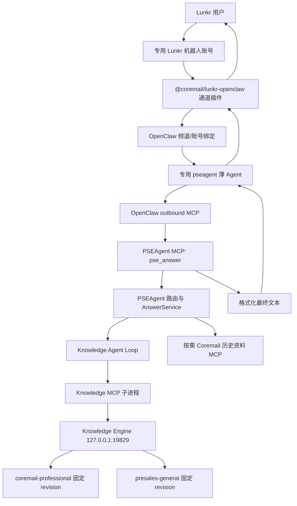

# PSEAgent 接入 Lunkr/OpenClaw 设计

日期：2026-07-24

状态：用户已确认

实施目标：在当前 Windows 电脑上使用专用 Lunkr 机器人账号接收纯文字消息，将每条有效消息交给现有 PSEAgent `pse_answer`，并把 PSEAgent 的最终文本原样回复到来源会话。

## 1. 背景与设计依据

现有 PSEAgent 已经形成完整的问答主链：

```text
pse_answer
  → professional/general/normal 路由
  → 普通回答或有界 Knowledge Agent Loop
  → Knowledge MCP
  → Knowledge Engine
  → 固定 revision 的专业库或通用库
  → 引用校验与最终文本
```

PSEAgent 对外只暴露 `pse_answer(question, conversationContext?)`。路由、知识库选择、检索动作、页面读取、引用注册、知识缺口判断和最终答案均由 PSEAgent 内部负责。外部消息宿主不得重新实现这些决策，也不得使用自己的知识回答覆盖 PSEAgent 输出。

`@coremail/lunkr-openclaw` 是 OpenClaw 的 Lunkr 消息通道插件。它负责账号登录、消息接收、触发策略、会话路由和消息发送，但不会自动连接本项目的 `pse_answer`。因此接入工作必须在 Lunkr 通道和 PSEAgent MCP 之间建立一个受约束的 OpenClaw 转发边界。

## 2. 目标与非目标

### 2.1 目标

- 使用一个专用 Lunkr 机器人账号，不与个人日常聊天共用。
- 私聊机器人账号时，每条纯文字消息自动触发回答。
- 普通群聊中，只有明确 `@机器人` 的纯文字消息触发回答。
- 专用 Bot 讨论组中，每条纯文字消息自动触发回答。
- 每条有效消息只调用一次 PSEAgent `pse_answer`。
- PSEAgent 返回的最终文本原样发送，不由 OpenClaw 扩写、总结或修正。
- 为每个私聊或群聊维持隔离的有限多轮上下文。
- 在当前 Windows 电脑上长期运行，并支持登录后自动启动。
- 账号、Cookie、会话、模型密钥和服务 token 均保存在 Git 之外。
- 安装、配置和健康检查可重复执行，不因重复运行产生重复 Agent、重复绑定或重复计划任务。

### 2.2 非目标

第一版不实现：

- 图片、语音、视频或文件内容理解；
- OCR、语音识别或附件解析；
- 修改 PSEAgent 的知识路由、Agent Loop、引用规则或知识库边界；
- 在 Lunkr 插件内重新实现 LLM 或 RAG；
- 把 `coremail-knowledge-mcp` 直接暴露给 OpenClaw；
- 修改 `coremail-professional` 或 `presales-general` 的知识内容；
- Linux、容器、云主机或多节点部署；
- 多个 Lunkr 账号、多租户或账号池；
- 自动上传知识、知识审核或知识写回。

## 3. 多仓边界

`C:\Users\Coremail\Desktop\Coremail-PSE` 不是 Git 仓库。接入工作遵循以下边界：

| 目录 | Git 仓库 | 职责 | 本次处理 |
| --- | --- | --- | --- |
| `pseagent-platform` | 是 | PSEAgent、Knowledge MCP、Knowledge Engine、运行与测试 | 唯一允许新增接入代码和文档的仓库 |
| `coremail-professional` | 是 | Coremail 专业知识库 | 固定 revision，只读 |
| `presales-general` | 是 | 通用售前知识库 | 固定 revision，只读 |
| `coremail-knowledge-mcp` | 是 | Jira/Wiki 历史资料降级来源 | 继续仅由 PSEAgent 内部按需启动 |
| `docs` | 否 | 既有临时资料 | 不存放正式接入代码、配置或规格 |

四个 Git 仓库都没有 remote，不创建 remote、不推送、不跨仓暂存或提交。

`pseagent-platform` 当前存在用户未提交修改。正式实现不得覆盖、暂存或提交这些修改。开始实现时应使用独立 Git worktree/feature branch 隔离 Lunkr 接入工作；最终集成前再由用户决定如何与当前工作树合并。

## 4. 方案比较与选择

### 4.1 方案 A：OpenClaw 原生 MCP + 专用薄 Agent

OpenClaw 使用原生 outbound MCP 配置启动 PSEAgent stdio MCP；一个专用 OpenClaw Agent 只能使用 `pse_answer`，负责把当前消息和有限会话上下文传入，并原样返回结果。

优点：

- 不修改或派生第三方 Lunkr 插件；
- 不修改 PSEAgent 对外契约；
- 使用 OpenClaw 原生 MCP、Agent 和频道绑定能力；
- Lunkr 插件可独立升级；
- 开发量最小，适合先完成本机可用闭环。

限制：

- OpenClaw 仍有一层模型驱动的工具调用；
- 必须通过工具 allowlist、专用 workspace 指令和验收用例约束其行为；
- 如果实际联调证明 OpenClaw 仍可能漏调、重复调用或改写答案，需要升级到方案 B。

### 4.2 方案 B：派生 Lunkr 插件并直接调用 PSEAgent MCP

在 Lunkr 入站处理处绕过 OpenClaw 通用 Agent，直接调用 `pse_answer` 后发送结果。

优点是调用确定性更高、没有外层模型决策；缺点是需要维护 Lunkr 插件派生版本、跟踪上游升级，并扩大认证和消息通道代码的维护范围。

### 4.3 方案 C：在 PSEAgent 内实现 Lunkr 客户端

由 PSEAgent 自己管理 Lunkr 登录、WebSocket、消息触发和回复。

该方案会重复第三方插件已经提供的能力，使消息通道与问答核心强耦合，安全面和维护成本最高。

### 4.4 选择

第一版采用方案 A。方案 B 只作为验收失败后的升级路径；不实施方案 C。

## 5. 总体架构



OpenClaw 薄 Agent 不拥有业务知识，不执行 professional/general/normal 路由，也不直接访问三个知识来源。它的唯一业务动作是调用一次 PSEAgent `pse_answer`。

## 6. 消息触发与账号模式

机器人使用独立 Lunkr 账号。完成扫码登录后，将当前账号绑定为 Lunkr Agent Account，并将该 Lunkr channel account 绑定到 OpenClaw `pseagent` Agent。

触发规则：

| 场景 | 触发条件 | 会话边界 |
| --- | --- | --- |
| 私聊 | 对方发送任意非空纯文字 | 每个私聊对端独立 |
| 普通群聊 | 消息明确 `@机器人` | 每个群独立 |
| Bot 讨论组 | 任意非空纯文字 | 每个 Bot 讨论组独立 |
| 图片、文件、语音、视频 | 不调用 PSEAgent | 原会话返回固定不支持提示 |
| 空消息或只有空白 | 忽略 | 不创建问答调用 |

Bot 讨论组可以使用 `openclaw lunkr bot-create` 创建，但 Agent 选择不依赖 `bot-create --agent-id`。整个 `lunkr-openclaw:default` 账号通过 OpenClaw channel binding 固定路由到 `pseagent`，避免插件内部 discussion metadata 与 OpenClaw Agent 路由不一致。

## 7. 多轮上下文

PSEAgent 接口允许最多 32 KiB 的 `conversationContext`。OpenClaw 为不同私聊和群聊维护独立 session，薄 Agent 从当前 session 的最近历史构造上下文。

上下文规则：

- 当前消息放入 `question`；
- 只使用同一个 OpenClaw session 的历史；
- 私聊以 Lunkr 对端为 session 边界；
- 群聊和 Bot 讨论组以群 ID 为 session 边界；
- 使用最近的用户消息和机器人最终回复；
- 不包含工具调试信息、模型隐藏推理、认证信息或附件二进制；
- 超过 32 KiB 时从最旧消息开始确定性裁剪；
- 不允许把其他私聊、其他群或默认 Agent 的历史带入；
- 第一次消息不强制传空字符串，直接省略 `conversationContext`。

薄 Agent workspace 指令必须明确要求：

1. 每条有效用户消息只调用一次 PSEAgent 工具；
2. `question` 必须是当前消息去除通道触发标记后的正文；
3. `conversationContext` 只能来自当前 session；
4. 工具成功后只发送工具返回的文本；
5. 工具失败时发送固定服务不可用提示；
6. 禁止使用模型先验自行回答。

## 8. OpenClaw MCP 与 Agent 配置

OpenClaw 将 PSEAgent 注册为本地 stdio MCP：

- command：当前 Node.js 可执行文件；
- working directory：`pseagent-platform` 绝对路径；
- args：
  - `--env-file=<pseagent-platform\.env.local>`；
  - `<pseagent-platform\apps\pseagent\dist\main.js>`；
- tool filter：只包含 `pse_answer`；
- request timeout：覆盖 PSEAgent 最长模型与检索调用时间；
- enabled：true。

安装流程通过 `openclaw mcp probe pseagent --json` 获取 OpenClaw 投影后的实际工具名，并把这个实际名称写入专用 Agent 的 tool allowlist。实现和模板不硬编码未经探测的 namespaced tool 名。

专用 Agent：

- id：`pseagent`；
- workspace：`C:\Users\Coremail\.openclaw\workspace-pseagent`；
- channel binding：`lunkr-openclaw:default`；
- 只允许使用探测得到的 PSEAgent 工具和 OpenClaw 运行所需的最小内建能力；
- 禁止 shell、文件写入、浏览器、任意消息发送、其他 MCP 和跨 Agent 调用；
- 不与 OpenClaw 默认 Agent 共用 workspace 或 session store。

## 9. 仓库内文件架构

所有正式新增文件位于 `pseagent-platform`：

```text
pseagent-platform/
├─ apps/
│  └─ pseagent/                         # 现有问答核心，第一版不改外部契约
├─ integrations/
│  └─ openclaw-lunkr/
│     ├─ package.json
│     ├─ tsconfig.json
│     ├─ src/
│     │  ├─ cli.ts                      # setup/status/verify 命令入口
│     │  ├─ preflight.ts                # 环境、构建产物、端口和 revision 检查
│     │  ├─ openclaw-config.ts          # MCP、Agent、tool allowlist 和绑定
│     │  ├─ process-runner.ts           # 可注入、可测试的命令执行边界
│     │  ├─ windows-service.ts          # Knowledge Engine 计划任务管理
│     │  └─ redaction.ts                # 输出脱敏
│     ├─ templates/
│     │  └─ AGENTS.md                   # 薄 Agent 行为约束
│     └─ src/*.test.ts
├─ scripts/
│  ├─ setup-openclaw-lunkr.mts
│  ├─ status-openclaw-lunkr.mts
│  └─ verify-openclaw-lunkr.mts
├─ docs/
│  ├─ local-runbook.md
│  └─ superpowers/
│     ├─ specs/
│     └─ plans/
└─ package.json
```

`integrations/openclaw-lunkr` 作为 npm workspace 参与根目录 typecheck 和 test。安装逻辑由 TypeScript 实现，PowerShell 只作为 Windows 计划任务的受控执行环境，避免把核心配置逻辑散落在不可单元测试的脚本中。

## 10. Windows 运行模型

### 10.1 常驻进程

长期运行只要求两个顶层常驻部分：

1. Knowledge Engine：
   - 可执行文件为 `target\release\knowledge-engine.exe`；
   - 通过当前用户级 Windows 计划任务在登录后启动；
   - 从 `.env.local` 加载环境；
   - 只监听 `127.0.0.1:19829`；
   - 启动后必须验证两个知识库 revision 和 ready 状态；
   - 计划任务名称固定且安装幂等，发现同名非本项目任务时拒绝覆盖。

2. OpenClaw Gateway：
   - 使用 OpenClaw 自身的 Windows daemon/计划任务能力；
   - 保持 Lunkr WebSocket 和账号会话；
   - 按需启动 PSEAgent stdio MCP。

PSEAgent、Knowledge MCP 和 Coremail 历史资料 MCP 不注册为独立 Windows 常驻服务：

- OpenClaw 按需启动 PSEAgent；
- PSEAgent 启动 Knowledge MCP；
- PSEAgent 仅在主知识结果为 `not_covered` 时按需使用 Coremail 历史资料 MCP；
- 父进程退出时清理子进程。

### 10.2 启动顺序

```text
Windows 用户登录
  → Knowledge Engine 计划任务启动并变为 ready
  → OpenClaw Gateway 启动
  → Lunkr 账号恢复会话和 WebSocket
  → 首条有效消息到达
  → OpenClaw 启动或复用 PSEAgent MCP
```

Knowledge Engine 暂未 ready 时，Lunkr 通道仍可在线，但 PSEAgent 专业/通用问题应返回现有的暂时不可用文本。

## 11. 配置、认证与安全

配置分为三类：

1. 仓库内可提交模板：
   - 不含账号、密码、Cookie、SID、token、API key 或内网认证内容；
   - 只包含配置键、相对职责和示例占位说明。

2. 项目本机配置：
   - `pseagent-platform\.env.local`；
   - `config\knowledge-projects.local.json`；
   - 索引、日志和运行探针输出；
   - 均保持 Git ignored。

3. 用户级运行状态：
   - `C:\Users\Coremail\.openclaw\`；
   - `C:\Users\Coremail\.lunkr\`；
   - Coremail MCP 本机认证存储；
   - 不复制进仓库或测试夹具。

Lunkr 优先扫码登录。用户不在聊天中提供密码、Cookie、SID、API token 或二维码截图。所有真实认证只在本机交互终端或二维码流程内完成。

日志只允许记录：

- 时间；
- 组件名；
- 脱敏错误码；
- session 类型，不记录具体用户或群名称；
- scope、status、引用数量、调用耗时；
- 服务健康状态。

日志不得记录用户完整问题、完整回答、会话上下文、知识页正文、模型密钥、Knowledge Engine token、Lunkr 会话数据或 Jira/Wiki 认证信息。

## 12. 安装与幂等性

集成 CLI 提供：

```text
setup
status
verify
```

共同要求：

- 默认先执行 preflight；
- 支持 `--dry-run`；
- 不自动写入或覆盖 `.env.local` 的密钥；
- 每项配置先读取当前状态，再决定创建、更新或跳过；
- 已存在且匹配时报告 unchanged；
- 已存在但目标不一致时停止并显示脱敏差异；
- 账号扫码和需要人工确认的 OpenClaw onboarding 不伪造非交互结果；
- 安装失败不得清除已有 Lunkr 会话或 OpenClaw 配置。

`setup` 负责：

- 检查 OpenClaw CLI；
- 注册或校验 PSEAgent MCP；
- 探测实际工具名；
- 创建或校验专用 Agent workspace；
- 写入受控 `AGENTS.md`；
- 设置 tool allowlist；
- 绑定 `lunkr-openclaw:default`；
- 安装或校验 Knowledge Engine 计划任务；
- 引导安装 Lunkr 插件、扫码和 Agent Account 绑定。

`status` 只读检查本地文件、端口、进程、计划任务、OpenClaw Gateway、MCP、Agent binding 和 Lunkr 登录状态。

`verify` 执行离线契约测试或用户明确启动的真实探针，不静默触发二维码登录。

## 13. 错误处理

| 故障 | 行为 |
| --- | --- |
| OpenClaw 未安装 | preflight 失败并给出官方安装命令 |
| Lunkr 未登录或会话过期 | 不删除会话；提示重新扫码 |
| Knowledge Engine 未启动 | 专业/通用问题由 PSEAgent 返回现有暂时不可用文本 |
| PSEAgent MCP 无法启动 | 返回固定“问答服务暂时不可用，请稍后重试。” |
| 模型端点不可达 | 保留 PSEAgent 现有 `temporarily_unavailable` 语义 |
| 知识库未覆盖 | 原样发送 `not_covered` 文本 |
| 历史资料 MCP 不可用 | 保持 PSEAgent 主 `not_covered`，不提升为服务故障 |
| OpenClaw 工具调用失败 | 不由外层模型自行补答，发送固定服务不可用提示 |
| 非文字消息 | 返回“当前仅支持文字消息。” |
| 重复入站事件 | 依赖 Lunkr/OpenClaw 消息 ID 去重；同一消息不得重复调用 PSEAgent |
| 回复发送失败 | 记录脱敏错误并由通道既有重连/重试机制处理，不重复生成答案 |

## 14. 测试设计

### 14.1 离线测试

在家庭网络即可完成：

- preflight 对 Node、构建产物、绝对路径、端口和 revision 的校验；
- OpenClaw 命令生成快照；
- `--dry-run` 不产生系统修改；
- setup 重复执行的幂等性；
- 已存在冲突配置时拒绝覆盖；
- MCP probe 结果中只接受 `pse_answer`；
- 实际 namespaced tool 名解析；
- 专用 Agent allowlist 生成；
- 私聊、群聊和 Bot 讨论组 session key 隔离；
- 32 KiB 上下文从最旧消息开始裁剪；
- 非文字消息不产生 PSEAgent 调用；
- 工具成功后原样返回；
- 工具失败时禁止模型补答；
- 日志不包含密钥、token、问题正文或回答正文；
- Windows 计划任务命令构造和同名冲突保护；
- 现有 `npm run typecheck`、`npm test` 和构建回归。

外部进程调用必须通过可注入 runner，在测试中使用 fake runner，不安装真实 OpenClaw、不更改真实用户配置、不启动二维码登录。

### 14.2 公司网络真实验收

模型端点恢复可达后执行：

1. `npm run probe:live` 通过；
2. Knowledge Engine `/health` 返回两个正确 revision；
3. `openclaw mcp doctor pseagent --probe` 成功；
4. probe 只暴露 PSEAgent `pse_answer`；
5. `openclaw agents list --bindings` 显示 Lunkr default account 绑定到 `pseagent`；
6. 专用 Lunkr 账号扫码登录并成为 Agent Account；
7. 私聊首轮专业问题得到带引用回答；
8. 私聊后续代词问题能利用同一会话上下文；
9. 第二个私聊用户看不到第一个用户上下文；
10. 普通群未 @ 时不回答，@后回答；
11. Bot 讨论组无需 @ 自动回答；
12. 非文字消息只收到固定不支持提示；
13. 模型端点断开时得到暂时不可用文本，恢复后无需重建配置；
14. OpenClaw Gateway 重启后账号、MCP 和绑定仍可用；
15. Windows 重新登录后 Knowledge Engine 与 OpenClaw 自动恢复。

真实验收输出只记录 scope、status、引用数量、耗时和组件状态，不记录问题、答案或认证信息。

## 15. 发布、回滚与升级路径

### 15.1 发布

先完成离线实现和测试，再在公司网络执行真实联调。Lunkr 账号绑定和 Windows 计划任务属于本机部署状态，不纳入 Git commit。

每个实现阶段必须：

- 在 `pseagent-platform` 独立提交；
- commit 标题和正文使用中文；
- 正文包含“完成内容”和“验证结果”；
- 不跨仓提交；
- 向用户报告完整 commit 哈希、验证命令和结果。

### 15.2 回滚

回滚顺序：

1. 解除 OpenClaw 的 Lunkr channel binding；
2. 禁用或移除专用 `pseagent` Agent；
3. 删除 PSEAgent MCP registry 条目；
4. 卸载 Lunkr extension 配置时默认保留账号会话；
5. 用户明确要求时才 purge Lunkr 会话；
6. 删除本项目创建的 Knowledge Engine 计划任务；
7. 不删除知识库、索引、`.env.local` 或 Coremail MCP 认证。

所有卸载动作必须先显示精确目标并要求显式确认；不得使用递归删除清理整个用户目录或仓库。

### 15.3 升级到直接适配

出现以下任一可稳定复现的验收失败时，停止继续加强提示词，重新评估方案 B：

- OpenClaw 薄 Agent 漏调 `pse_answer`；
- 同一入站消息重复调用；
- OpenClaw 改写 PSEAgent 最终文本；
- 薄 Agent 在工具失败时自行生成业务答案；
- 会话上下文无法可靠隔离或裁剪；
- 外层模型调用带来不可接受的延迟或成本。

升级时只替换 Lunkr 到 `pse_answer` 的转发层，PSEAgent、Knowledge MCP、Knowledge Engine 和三个知识来源边界保持不变。

## 16. 当前已知环境状态

截至设计确认时：

- Windows Node.js 为 v24.15.0；
- PSEAgent、Knowledge MCP 和 release Knowledge Engine 构建产物存在；
- Knowledge Engine 正在 `127.0.0.1:19829` 运行；
- 专业库 revision 为 `e003c787326609afc3b6d4159e5096a8c29128ed`；
- 通用库 revision 为 `ca4ee0f8fb3c466378371c14bf3394c82a903281`；
- 现有 TypeScript、Knowledge MCP 和 Rust 测试通过；
- OpenClaw 尚未安装；
- 当前家庭网络无法连接 `.env.local` 配置的模型端点，真实 `probe:live` 因模型路由不可用而失败；
- 该网络条件只阻塞真实联调，不阻塞离线设计、实现和 fake-runner 测试。

## 17. 验收标准

第一版完成必须同时满足：

- 仅 `pseagent-platform` 有接入实现提交；
- 其他三个 Git 仓保持原 revision 和干净状态；
- 私聊、普通群 @、Bot 讨论组三种触发行为符合约定；
- 非文字消息不进入 PSEAgent；
- 每条有效消息只调用一次 `pse_answer`；
- 多轮上下文按会话隔离且不超过接口上限；
- 最终文本不被 OpenClaw 改写；
- Knowledge Engine 和 OpenClaw 可在 Windows 登录后自动启动；
- 安装与状态检查幂等；
- 认证和敏感配置不进入 Git 或测试输出；
- 全部离线测试和现有回归通过；
- 公司网络真实验收全部通过；
- 重启 Gateway 和重新登录 Windows 后服务仍可恢复。
