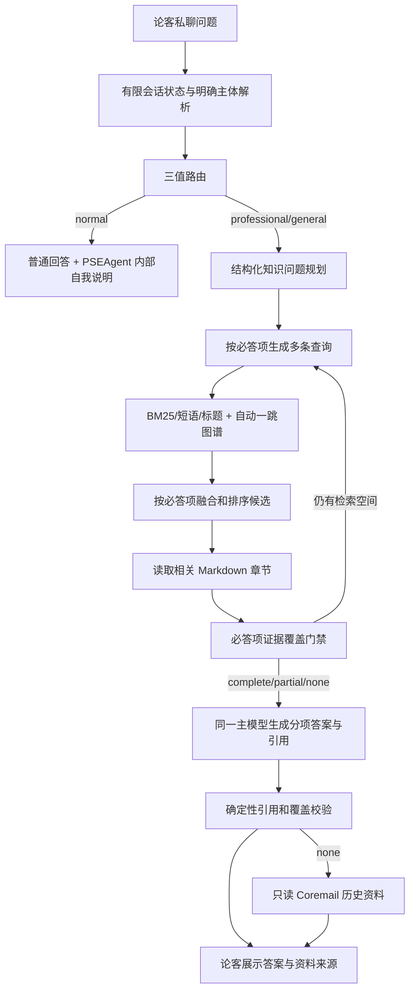

# PSEAgent 证据覆盖式检索根治设计

日期：2026-07-27  
状态：用户已确认  
适用仓库：`C:\Users\Coremail\Desktop\Coremail-PSE\pseagent-platform`

## 1. 文档定位

本文修订 `2026-07-22-pseagent-single-entry-dual-kb-agent-loop-design.md`
中的路由、检索、读页、覆盖判定、测试和可观测性设计。单入口、三值
`scope`、单库绑定、只读知识库、固定 revision、无自动写回等边界保持不变。

本次修订解决真实论客私聊验收中暴露的四类问题：

1. PSEAgent 自身目标和架构被会话历史误导为专业知识问题；
2. 复合问题没有被拆成必须逐项完成的检索要求；
3. 词法检索、图谱和读页彼此割裂，模型检索词跑偏后难以恢复；
4. 现有脚本化回归验证协议正确性，但没有验证真实索引召回和答案覆盖。

## 2. 用户确认的约束

- 当前不提供 Embedding 模型；向量检索只保留可选扩展接口，本次不启用。
- 只在正式知识库完全 `not_covered` 时调用只读 Coremail Jira/Wiki 历史资料。
- `partially_answered` 不调用历史资料。
- 单次论客问答最长允许等待 5 分钟。
- PSEAgent 自身目标、架构、运行边界和与 Lunkr 的关系均属于 `normal`。
- PSEAgent 自身说明来自运行时内部系统上下文，不建立第三个知识库。
- 专业和通用知识回答必须向用户展示引用。

## 3. 根治目标

- 当前问题中的明确主体优先于历史对话主题。
- 每个知识问题先形成结构化的必答项，再开始检索。
- 每个必答项分别检索、读取和登记证据，不能由其他项目的一条引用代替。
- 一次搜索自动完成词法召回和一跳图谱扩展，不再依赖模型额外发现图谱工具。
- 没有 Embedding 时仍通过 BM25、标题/短语加权、查询覆盖率、多查询融合和图谱扩展获得稳定召回。
- 长页面按相关 Markdown 章节读取，不再只截取最早命中词附近的固定窗口。
- 最终动作逐项声明覆盖状态和引用；程序以必答项为单位做硬门禁。
- 把协议测试、真实索引测试和真实模型回答测试明确分层。
- 开发诊断可以还原“路由—规划—召回—读页—覆盖—引用”全过程。

## 4. 保持不变的边界

- 对外仍只有 `pse_answer(question, conversationContext?)`。
- 对外 `scope` 仍只有 `professional`、`general`、`normal`。
- `professional` 只绑定 `coremail-professional`。
- `general` 只绑定 `presales-general`。
- 不跨库补答案，不访问公网，不自动写知识库，不自动提交知识库。
- 正式引用必须来自当前绑定项目、当前 revision、实际读取成功且哈希一致的页面。
- Lunkr 只负责私聊消息输入、有限会话上下文和回答输出，不参与路由和检索。
- 不增加独立 Judge 模型或五维评分服务。

## 5. 总体流程



## 6. 路由与 PSEAgent 自身问题

### 6.1 明确主体优先

路由按以下顺序处理：

1. 当前问题明确出现 `PSEAgent`、`当前机器人`、`你自己` 等自指主体时固定为 `normal`；
2. 当前问题明确出现 Coremail、具体产品、邮件系统、客户项目等主体时为 `professional`；
3. 当前问题明确为厂商无关售前方法时为 `general`；
4. 只有当前问题依赖代词时，才使用有限会话状态解析主体；
5. 仍无法确定主体时，由普通回答请求澄清，不借历史主题盲目进入知识库。

完整的历史回答正文不再直接主导路由。Lunkr 会话存储可以继续保留有限历史，
但路由只接收当前问题和受控的主体提示。

### 6.2 PSEAgent 内部自我说明

运行时维护一段受版本控制、不可由用户或知识页修改的内部系统上下文，至少说明：

- PSEAgent 是 Coremail 售前问答统一入口；
- 普通、专业、通用三类问题的处理边界；
- 专业库和通用库的单库绑定；
- Lunkr 只是消息通道；
- 当前直连 Lunkr，不使用 OpenClaw；
- 正式知识引用和历史资料兜底规则。

该上下文只进入 `normal` 回答提示词，不注册引用、不进入 Knowledge Engine，也不创建
`internal` scope 或第三知识库。

## 7. 结构化知识问题规划

专业或通用问题进入知识库前，同一主模型输出严格规划：

```json
{
  "subject": "Coremail安全网关",
  "requirements": [
    {
      "id": "R1",
      "question": "详细功能清单",
      "queries": ["Coremail安全网关 功能清单", "CACTER CAC 功能"]
    },
    {
      "id": "R2",
      "question": "POC注意事项",
      "queries": ["网关POC测试要点", "安全网关 POC 注意事项"]
    }
  ]
}
```

约束：

- `requirements` 为一到六个互不重复的必答项；
- 单一事实问题也必须生成一个必答项；
- 每个必答项包含一到三条简短查询；
- 查询保留明确产品、场景、规模、版本和动作词；
- 不得把 Wiki 页码、Confluence page ID 或来源文件编号当作首选查询；
- 规划失败允许一次格式修复；连续失败为 `temporarily_unavailable`。

## 8. 无 Embedding 的混合检索

### 8.1 词法评分

词法索引改为真正包含文档频率和长度归一化的 BM25。字段与信号优先级为：

1. 规范路径或文件名精确命中；
2. 标题精确命中；
3. 标题完整短语；
4. 正文完整短语；
5. 标题 BM25；
6. 正文 BM25；
7. 查询有效词覆盖率。

中文查询继续使用 Jieba、连续 CJK bigram 和完整词。只要存在多字词，单汉字不参与
主要排序；单字查询才保留单字匹配。通用词只匹配少量字符时不得压过完整标题和短语。

### 8.2 自动图谱扩展

每次搜索先取词法种子，再自动扩展一跳：

- `related`；
- 正文 `[[wikilink]]`；
- 受控来源关系；
- 反向链接。

最终候选为词法结果和图谱结果的受控混合，图谱结果保留约 20% 至 30% 名额。图谱页面
仍需读取后才能成为引用，但不再消耗一次模型可见 `kb.graph` 动作才能被发现。

### 8.3 多查询融合

同一必答项的多条查询分别检索，使用 Reciprocal Rank Fusion 合并路径。融合结果记录：

- 来源查询；
- 词法排名和分数；
- 是否来自图谱扩展；
- 命中词；
- 支持的 requirement ID。

Embedding 后续可以作为第三路候选接入融合，不改变规划、读页、覆盖和引用契约。

### 8.4 导航上下文

Knowledge Engine 不再把完整 `wiki/overview.md` 直接交给模型。导航上下文改为：

- 项目根目录 `purpose.md` 的受控长度正文；
- `schema.md` 的受控长度规则；
- 必要的页面类型说明。

`overview.md`、`index.md`、`log.md` 继续不进入业务检索结果。长 `related` 数组、页面 ID 和
来源清单不能污染检索规划。

## 9. 章节化读页

Markdown 页面按标题解析为章节。读取页面时根据当前 requirement 的查询词评分：

- 短页面返回全文；
- 长页面返回标题、来源和最高相关的二到三个完整章节；
- 总观察长度有界，但不能从章节中间任意截断；
- 页面被不同 requirement 使用时分别生成相关章节观察；
- 引用注册仍以整页 project/revision/path/contentHash 为身份。

## 10. 证据覆盖门禁

运行时维护：

```text
requirement -> queries -> candidate paths -> read paths -> citation indexes -> coverage
```

最终动作改为逐项覆盖：

```json
{
  "action": "final",
  "requirements": [
    {"id": "R1", "coverage": "complete", "citations": [1]},
    {"id": "R2", "coverage": "partial", "citations": [2]}
  ],
  "answer": "……[1]……[2]",
  "citations": [1, 2]
}
```

硬规则：

- 每个规划出的 requirement 必须在最终动作出现且只出现一次；
- `complete` 必须至少引用一个为该 requirement 实际读取的页面；
- `partial` 必须有证据，并在答案中明确未覆盖部分；
- `none` 不得引用页面；
- 任一 requirement 为 `partial` 或 `none` 时整体不能是 `answered`；
- 所有 requirement 均为 `none` 或没有任何有效读页时才是 `not_covered`；
- 有部分有效证据时固定为 `partially_answered`，不得调用历史资料；
- 正文引用编号必须与逐项引用并集和顶层引用数组一致。

这不是独立 Judge。规划、动作选择和最终生成继续使用同一个主模型；程序只校验结构、
来源身份和逐项覆盖关系。

## 11. 预算、超时与收敛

- 总请求 deadline 为 300 秒。
- 内部主动停止目标为 270 秒，预留最终格式化和 Lunkr 发送时间。
- 每个 requirement 默认最多两轮查询，每轮最多三条查询。
- 每个 requirement 默认最多读取三个页面。
- 模型动作预算根据 requirement 数动态计算，不再把所有 search/read/graph 固定合计为四次。
- 完全相同或规范化后等价的查询不重复执行。
- 某 requirement 连续两轮没有新增候选或新增证据时停止该项检索。
- 有证据的其他 requirement 不受单项无增益影响。
- 达到时间预算时基于已登记证据返回 `partial`；没有证据才返回 `not_covered`。

## 12. 引用展示

知识回答中每个主要部分就近使用 `[n]`，末尾继续展示：

```text
资料来源：
[1] 页面标题 — coremail-professional/wiki/...
```

`normal` 和 PSEAgent 自身问题不产生知识库引用。历史资料沿用独立警告和历史来源区域，
不能混入正式知识库编号。

## 13. 历史资料兜底

- 仅正式知识结果为 `not_covered` 时调用只读 Coremail MCP。
- `partially_answered` 不调用。
- 技术故障 `temporarily_unavailable` 不调用。
- 历史资料不改变正式结果的 `scope`、`status` 和 `references`。
- 历史答案继续标记未验证、可信度和来源。

## 14. 可观测性

默认生产日志不记录密码、Cookie、SID、密钥、完整问题和完整答案。开发诊断模式可记录：

- request ID；
- 当前问题主体和 scope；
- requirement 列表；
- 每条查询；
- 候选路径、分数、来源查询和图谱关系；
- 实际读页和章节；
- requirement 覆盖状态；
- 停止原因、耗时和最终引用。

诊断模式由显式本机配置启用，日志写入临时目录且不得提交。

## 15. 测试与验收

### 15.1 协议单元测试

保留现有脚本化测试，但明确命名为协议测试，验证 Schema、项目隔离、revision、路径、
状态映射和历史兜底边界。

### 15.2 真实索引回归

直接使用固定知识库 revision，验证：

- 每个 requirement 的预期证据页进入 Top 10；
- 精确标题和完整短语高于只匹配单汉字的页面；
- 自动图谱候选能够出现；
- 导航页和来源 ID 不污染业务候选；
- 长页面能提取相关完整章节。

### 15.3 真实模型回归

至少覆盖以下五题及同义改写：

1. `PSEAgent` 目标和架构：`normal`，知识调用为零，回答来自内部自我说明；
2. Coremail AI 新功能：读取并引用 AI 页面；
3. 十万用户、邮件多活和镜像：分别覆盖规模、多活、镜像；
4. Domino 迁移：覆盖迁移流程、环境前提和特殊注意事项；
5. 网关功能和 POC：分别覆盖功能清单和 POC 注意事项。

每题至少验证 scope、status、requirement 覆盖、预期证据页、禁止事实、引用身份和耗时。
同义改写用于防止只对固定原句优化。

### 15.4 完成标准

- PSEAgent 自身问题永远不访问知识库。
- 五题黄金集每个必答项均有正确覆盖或明确的知识缺口说明。
- 知识库存在目标页面时，预期页面进入对应 requirement 的候选集合。
- `complete` 不再可能只凭一条无关引用通过。
- `partial` 不触发历史资料；只有 `not_covered` 触发。
- 用户可见引用均来自实际读页且与对应回答部分一致。
- 单次论客问答不超过 300 秒。
- 全量 TypeScript、Rust、真实索引回归和 Lunkr 私聊验收通过。

